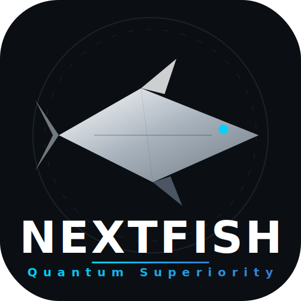

<p align="center">
  
</p>

# 👑 Nextfish Overlord v2.0 (Hybrid Lc0 Edition)

Nextfish is a high-performance chess engine forked from Stockfish 17.1, now featuring a **Hybrid Lc0 Policy Integration** for superior strategic intuition.

## 🧠 New: Lc0 Policy Root Filtering

In v2.0, Nextfish integrates a **Policy Network (Lc0)** to guide the search from the root node:
- **Root Policy Pruning**: At the start of the search, Nextfish uses the **BT4-it332** (or similar) network to identify the top 7 most promising strategic moves.
- **Focused Alpha-Beta**: The engine then focuses its immense calculation power primarily on these 7 candidates, achieving significantly higher depth on the most relevant branches.
- **Safety Verification**: (Experimental) A background search monitors non-policy moves to ensure no tactical "blind spots" are missed.

## 🚀 Key Improvements

- **Hybrid Architecture**: Combines the deep calculation of Stockfish with the "profound" intuition of Leela Chess Zero.
- **Aggressive NNUE Thresholding**: Set to **900** for earlier large-network engagement.
- **Asymmetric Time Management**: Black receives a **+15% time bonus** for stability.

## 🛠️ How to Enable Lc0 Policy

To use the Lc0 Policy feature, you must have the ONNX Runtime libraries installed and place your model file in the engine directory.
(Note: This feature is currently in the integration phase. Build with `LC0_POLICY=true` to enable).

## 📊 Automated Elo Testing

This repository features a **Continuous Integration (CI)** system. Every time code is pushed, GitHub Actions:
1. Builds the latest Nextfish source.
2. Pulls the official Stockfish 17.1 baseline.
3. Runs a **100-game match** (10s + 0.1s) using `fastchess`.
4. Outputs the Elo difference directly in the Action logs.

## 🛠️ How to Build

### Windows (MSYS2/MinGW)
```bash
cd src
make -j profile-build ARCH=x86-64-avx2
```

### Linux
```bash
cd src
make -j build ARCH=x86-64-avx2
```

## 📜 License
Nextfish is licensed under the **GNU General Public License v3.0**.