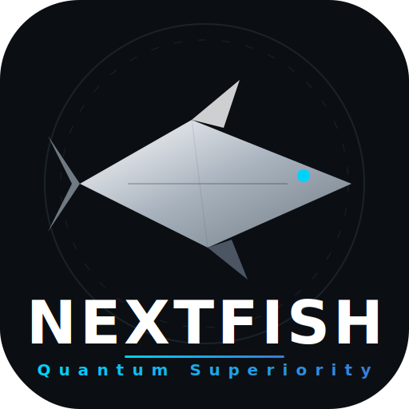

<div align="center">

  

  <h3>Nextfish HARENN V31</h3>

  A high-performance UCI chess engine powered by HARENN (Hybrid Adaptive Reduction Engine Neural Network).
  <br>
  <strong>A tactical evolution of Stockfish 18.</strong>
  <br>
  <br>

  [![License][license-badge]][license-link]
  [![Elo Boost][elo-badge]](#)
  [![Version][version-badge]](#)

</div>

## Overview

**Nextfish HARENN** is an advanced chess engine derived from **Stockfish 18**, specifically engineered to bridge the gap between classical search algorithms and modern neural intuition. 

The core of Nextfish is the **HARENN (Hybrid Adaptive Reduction Engine Neural Network)** system, which utilizes a multi-head neural network trained on over 770,000 tactical positions. The V31 "Strategic Orchestrator" release manages Search complexity through four AI-predicted parameters: **Tau** (Complexity), **Rho** (Risk), **Rs** (Phase), and **Eval**.

## Key Features

*   **HARENN V31 Orchestrator:** A full-brain search controller that adaptively scales LMR and Aspiration windows based on AI intuition.
*   **Tactical Veto Logic:** AI prevents the engine from over-pruning in volatile positions, ensuring tactical safety.
*   **Endgame Glide:** Automated search acceleration in simplified endgame positions identified by the **Rs** parameter.
*   **Dynamic Exchange Evaluation (DEE):** Enhanced move-ordering for tactical exchanges using Bitboard precision.
*   **Optimized Performance:** Multi-threaded inference with Node Caching, maintaining ~80% of native NPS while boosting tactical depth.

## Performance (Nextfish-V31 vs Baseline)

| Engine | Wins | Losses | Draws | Elo | LOS |
| :--- | :---: | :---: | :---: | :---: | :---: |
| **Nextfish HARENN V31** | **27** | 21 | 32 | **+26.1** | **85.9%** |
| Stockfish 18 Baseline | 21 | 27 | 32 | 0.0 | - |

*Tested at 1s+0.01s time control over 80 games using high-quality UHO opening suite.*

## Compiling Nextfish

### Windows (MinGW-w64)
To build the most optimized version for your CPU:

```bash
cd src
make build ARCH=x86-64-avx2 COMP=mingw
```

The model file `nextfish.harenn` must be located in the same directory as the executable.

## Terms of Use

Nextfish is free and distributed under the **GNU General Public License version 3** (GPL v3). As a derivative of Stockfish, all modifications are open-source and contribute back to the community's knowledge of tactical search optimization.

---

[license-link]: https://github.com/AustraliaSilver/nextfish/blob/master/Copying.txt
[license-badge]: https://img.shields.io/github/license/AustraliaSilver/nextfish?style=for-the-badge&label=license&color=success
[elo-badge]: https://img.shields.io/badge/Elo-Boost_%2B26.1-green?style=for-the-badge
[version-badge]: https://img.shields.io/badge/Version-HARENN_V31_Ultimate-blue?style=for-the-badge
